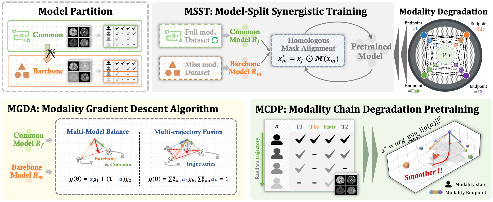
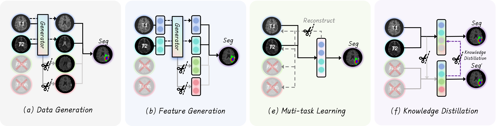
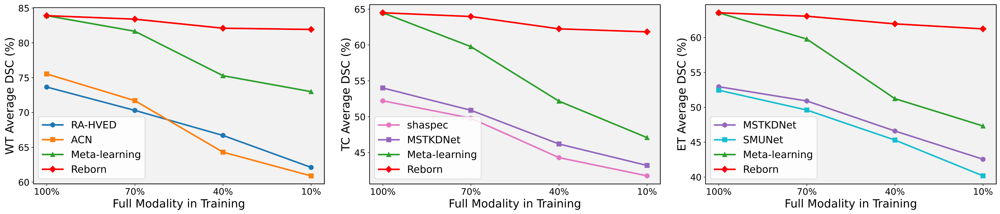
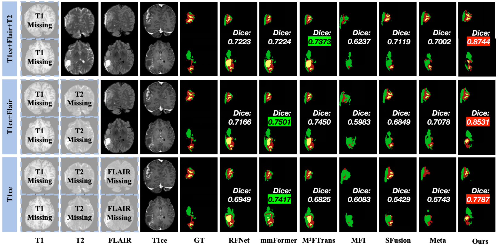

# ReBorn

> **Turning Full-Modality Segmentation Models into Missing-Modality Survivors**

<p align="center">
  
</p>

ReBorn is a backbone-agnostic training strategy for missing-modality medical image segmentation. It does not require modality synthesis, special inference modules, or architecture-specific assumptions. The model to be integrated is intentionally left as a placeholder in this repository; the code only provides the ReBorn method logic.

## Highlights

- **Backbone-agnostic**: plug in any multi-modal segmentation model later.
- **No synthesis at inference**: only the barebone segmentation path is deployed.
- **Limited full-modality supervision**: full-modality data is used as guidance, not as a hard requirement for every sample.
- **Gradient-level coordination**: MoGDA balances full-modality guidance and missing-modality segmentation updates.

## Method Overview

ReBorn converts a normal full-modality segmentation method into a missing-modality learner through three components:

| Component | Role | Implemented in |
| --- | --- | --- |
| **MCDP** | Pretrains with endpoint-covered modality degradation chains. | `strategy/ReBorn.py`, `strategy/MoGDA.py` |
| **MSST** | Splits training into common-model guidance and barebone inference learning. | `strategy/ReBorn.py` |
| **MoGDA** | Removes gradient conflict and fuses multi-objective updates. | `strategy/MoGDA.py` |

<p align="center">
  
</p>

## Repository Layout

```text
.
├── strategy/
│   ├── ReBorn.py       # Backbone-agnostic ReBorn method scaffold
│   ├── MoGDA.py        # MoGDA-B and MoGDA-F gradient solvers
│   └── __init__.py
├── models/
│   └── ...             # Put your target model here later
├── requirements.txt
└── imgs/               # Paper figures used by this README
```

## What Is Empty on Purpose?

The model integration is deliberately blank. Fill this class when you decide which model to use:

```python
from strategy.ReBorn import ReBornBackboneFactory


class MyFactory(ReBornBackboneFactory):
    def build_common_model(self):
        # TODO: return the full training/common model.
        # This branch can keep auxiliary modules used only during training.
        raise NotImplementedError

    def build_barebone_model(self):
        # TODO: return the deployable inference model.
        # This branch should consume observed modalities and output segmentation.
        raise NotImplementedError
```

## Core API

```python
from strategy.ReBorn import ReBornConfig, ReBornMethod

config = ReBornConfig(num_modalities=4)
reborn = ReBornMethod(
    common_model=common_model,
    barebone_model=barebone_model,
    config=config,
)
```

### MCDP: Modality Chain Degradation Pretraining

MCDP builds endpoint-covered degradation chains from a full-modality sample. Each chain starts from all modalities and removes modalities one by one while preserving a different endpoint modality. MoGDA-F then fuses trajectory gradients by solving a minimum-norm simplex problem.

```python
params = [p for p in common_model.parameters() if p.requires_grad]
fused_grad = reborn.mcdp_step(
    batch_full=batch_full,
    params=params,
    loss_fn=segmentation_loss,
)
reborn.assign_gradients(params, fused_grad)
optimizer.step()
```

### MSST: Model-Split Synergistic Training

MSST pairs a real missing-modality batch with a full-modality batch. The missing batch trains the barebone model. Its modality mask is also applied to the full-modality batch, so the common model provides guidance under the same modality condition.

```python
barebone_params = [p for p in barebone_model.parameters() if p.requires_grad]
fused_grad, common_loss, barebone_loss = reborn.msst_step(
    batch_missing=batch_missing,
    batch_full=batch_full,
    barebone_params=barebone_params,
    common_loss_fn=common_loss,
    barebone_loss_fn=barebone_loss,
)
reborn.assign_gradients(barebone_params, fused_grad)
optimizer.step()
```

Expected batch dictionary:

```python
batch = {
    "image": image_tensor,   # [B, M, D, H, W] or [B, M, H, W]
    "mask": modality_mask,   # [B, M] or [M], 1 means available
    "target": label_tensor,
}
```

## MoGDA

MoGDA-B treats the common-model gradient as upstream representation shaping and the barebone gradient as downstream segmentation adaptation. If the downstream gradient opposes the upstream direction, only the conflicting component is removed:

```text
g_b' = g_b - min(0, <g_b, g_c> / (||g_c||^2 + eps)) g_c
alpha = ||g_b'|| / (||g_c|| + ||g_b'|| + eps)
g = alpha g_c + (1 - alpha) g_b'
```

MoGDA-F fuses multiple MCDP trajectory gradients by selecting the minimum-norm direction inside their convex hull.

<p align="center">
  
</p>

## Data Convention

ReBorn assumes each sample has a modality availability mask. The current utilities use four MRI modalities and the 15 non-empty combinations:

```text
[flair, t1, t1ce, t2]
```

Missing modalities are zero-filled by multiplying the image tensor with the mask. Labels are still required for missing-modality samples.

## Visual Results

<p align="center">
  
</p>

## Current Status

This repository currently provides:

- ReBorn method scaffold.
- MoGDA-B and MoGDA-F gradient solvers.
- Paper-style README with figures.
- Placeholder hooks for future model integration.

It intentionally does **not** provide a completed integration with any concrete model.

## Citation

```bibtex
@inproceedings{reborn2026,
  title={ReBorn: Turning Full-Modality Segmentation Models into Missing-Modality Survivors},
  author={Anonymous},
  booktitle={NeurIPS},
  year={2026}
}
```
